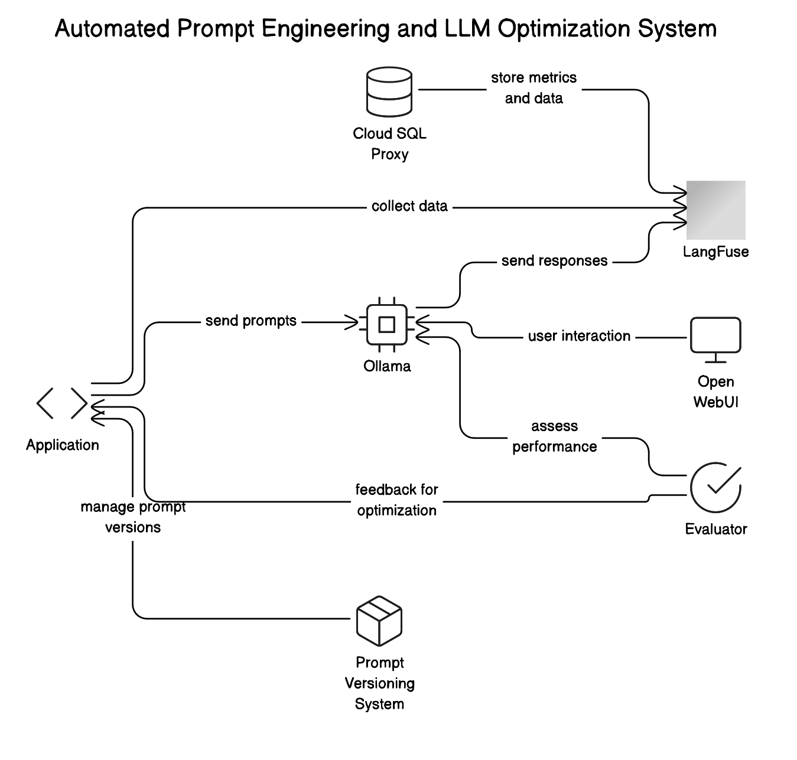

# PromptPilot
*Automatic Prompt Engineering Pipeline for LLM Applications*

## Introduction

PromptPilot is an automated prompt engineering pipeline designed to enhance and streamline the performance of Large Language Models (LLMs) with minimal manual intervention. As LLMs grow more sophisticated and their applications more diverse, refining their prompts to achieve consistently high-quality responses can become a complex, time-consuming, and iterative process. Small changes in prompt wording can often lead to large and unpredictable shifts in model behavior, making it challenging for developers, researchers, and businesses to reliably maintain and improve output quality.

PromptPilot addresses these challenges by leveraging continuous monitoring, data-driven metrics, and advanced optimization algorithms automatically discover, evaluate, and refine prompt variations. Through an iterative feedback loop, PromptPilot intelligently adapts its prompt formulations over time, guided by user-defined performance indicators like relevance, coherence, ethical compliance, and cost-effectiveness. The objective is a self-optimizing system that not only simplifies the prompt tuning process but also scales effortlessly across different LLMs and use cases.

## Project Overview



One of the project assumptions is to have a completely self-hosted enviroment for the execution. The only component which is not self-hosted is the Postgres database connected to LangFuse which is hosted of Google Cloud Platform.

The diagram shows a set of interconnected Dockerized services managed by a single docker-compose configuration. Each service contributes a specific function, working together to create a data-driven environment for automated prompt engineering and continuous LLM optimization:

1.	**Cloud SQL Proxy**:
Provides secure, authenticated access to a remote Cloud SQL database for storing metrics, prompts, and related data. It directly supports LangFuse for robust data management.
2.	**LangFuse**:
Central monitoring and analytics hub that collects, stores, and visualizes LLM metrics.
3.	**Ollama (LLM Runtime)**:
Hosts the LLM models locally, processes input prompts, and returns responses. Outputs feed into LangFuse and the evaluator for ongoing assessment and refinement.
4.	**Open WebUI**:
Offers a user-friendly interface to interact with the LLM, submit prompts, review responses, and observe the system’s adaptive behavior over time.
5.	**Application**:
Serves as the system’s “brain,” managing prompt execution via Ollama, and interfacing with LangFuse for monitoring and observability. The application in this case is a sample chatbot.
6.	**Evaluator**:
Continuously measures LLM outputs against defined criteria (e.g., relevance, accuracy, ethics) and provides feedback to improve prompt quality.
7.	**Prompt Versioning System**:
Manages and synchronizes prompt versions, ensuring the application and LangFuse stay aligned as prompts evolve.

All services communicate over a shared Docker network, ensuring smooth, low-latency integration. Persistent storage volumes (e.g., open-webui-data) maintain essential data and model files. Together, these components form a scalable, extensible framework for automated prompt engineering and continuous LLM refinement.

## Project Structure

Here is the organization of the repository.

```bash
.
├── app
│   └── templates
├── diagrams
├── docs
├── evaluator
│   └── templates
├── experiment
│   ├── dataset
│   └── results
├── models
│   └── models
│       ├── blobs
│       └── manifests
│           └── registry.ollama.ai
│               └── library
│                   ├── smollm2
│                   └── llama3.2
├── promptpilot
│   ├── optimizer
│   └── versioning
├── secrets
│   └── cloudsql
└── tests
```

## Cloud Architecture


This docker-compose.yml configuration defines a networked environment where multiple services work together to facilitate automated prompt engineering and continuous LLM optimization. It includes a secure Cloud SQL Proxy for database access, the LangFuse service for monitoring and analytics, Ollama for running and serving LLM models, Open WebUI for user interaction, and custom application and evaluator containers for orchestrating prompt execution and evaluating model outputs. All services are connected via a shared Docker network and make use of persistent storage volumes.

```yaml
version: '3.8'

services:
  cloud_sql_proxy:
    image: gcr.io/cloud-sql-connectors/cloud-sql-proxy:${CLOUD_SQL_PROXY_VERSION}
    container_name: cloud_sql_proxy
    command: >
      --port=${CLOUD_SQL_PROXY_PORT} --address=${HOSTNAME} --credentials-file=${CLOUD_SQL_PROXY_CREDENTIALS} ${GCLOUD_CONNECTION_NAME}
    ports:
      - "${CLOUD_SQL_PROXY_PORT}:${CLOUD_SQL_PROXY_PORT}"
    volumes:
      - ${CLOUD_SQL_PROXY_CREDENTIALS_PATH}:${CLOUD_SQL_PROXY_CREDENTIALS_VOLUME}:ro
    environment:
      - RUN_AS_USER=0
    env_file:
      - .env
    networks:
      - langfuse-network

  langfuse:
    image: langfuse/langfuse:${LANGFUSE_IMAGE_VERSION}
    container_name: langfuse
    env_file:
      - .env
    ports:
      - "${LANGFUSE_PORT}:${LANGFUSE_PORT}"
    depends_on:
      - cloud_sql_proxy
    networks:
      - langfuse-network
    healthcheck:
      test:
        [
          "CMD-SHELL",
          "node -e \"require('http').get('http://localhost:' + (process.env.LANGFUSE_PORT || 3000), res => process.exit(res.statusCode === 200 ? 0 : 1)).on('error', () => process.exit(1));\"",
        ]
      interval: 10s
      timeout: 5s
      retries: 2
      start_period: 5s
  
  ollama:
    image: ollama/ollama:latest
    container_name: ollama
    ports:
      - "11434:11434"
    volumes:
      - ./models:/root/.ollama
    networks:
      - langfuse-network

  open_webui:
    image: ghcr.io/open-webui/open-webui:ollama
    container_name: open_webui
    ports:
      - "3001:8080"
    volumes:
      - open-webui-data:/app/backend/data
      - ./models:/root/.ollama  # Ensure access to Ollama models
    environment:
      - OLLAMA_BASE_URL=http://ollama:11434  # Connect to the Ollama service within the network
    depends_on:
      - ollama
    networks:
      - langfuse-network
    restart: always

  application:
    build: 
      context: .
      dockerfile: app/Dockerfile
    container_name: application
    env_file:
      - .env
    depends_on:
      langfuse:
        condition: service_healthy
      ollama:
        condition: service_started
    networks:
      - langfuse-network
    ports:
      - "5001:5001"

  evaluator:
    build:
      context: ./evaluator
      dockerfile: Dockerfile
    container_name: evaluator
    env_file:
      - .env
    depends_on:
      langfuse:
        condition: service_healthy
      ollama:
        condition: service_started
    networks:
      - langfuse-network
    restart: unless-stopped
    ports:
      - "5002:5002"

networks:
  langfuse-network:
    driver: bridge

volumes:
  open-webui-data:
    driver: local
```

## Results

The fundamental question the project aimed to answer was how accurately and efficiently this method performs, and whether it can match human-level performance. To test this, several simulation tests were run on a set of prompt instruction datasets to:

- Collect simple instruction prompts.
- Enhance these prompts using LLM agent suggestions.
- Generate multiple responses for the original simple instruction prompts.
- Generate multiple responses for the improved instruction prompts.
- Evaluate a metric-based score for the original simple instruction prompts.
- Evaluate the same metric-based score for the improved instruction prompts.
- Compare the expected scores of the original vs. the improved prompts.

The prompt instruction dataset used for testing was [Stanford Alpaca](https://github.com/tatsu-lab/stanford_alpaca/tree/main), comprising 52k prompt instructions. Only a subset of these were selected for the testing due to time and computational constraints.
Overall the process showed a significant improvement in the metric performance with the refined prompt as showed in the following plots.


Here the metric performance is compared for the initial prompt and the refined prompt. We can observe that there is a high variance. Using larger models such as Llama3.3 would drastically reduce it and improve the overall improvement.


## Future Improvements

During the testing phase, we primarily worked with smaller models due to computational constraints. Specifically, Smollm models (smollm, smollm2) and Llama models (llama2, llama3.2) were tested. Manually fine-tuning the metaprompt (the prompt used to improve instruction prompts in the dataset) proved to be challenging: small models often produced only vaguely relevant answers, struggled to maintain focus on the actual task, and frequently deviated from the desired output format.
A major enhancement would be to implement structured generation with tools like XGrammar, which could help build a more robust and reliable system. In addition, deploying via Kubernetes would allow for better scalability, and using a GPU could enable the use of more powerful models or accelerate inference for the smaller models.


## Setup Guide

Please, refer to the installation documentation in [the `docs` folder](../docs).

## Project Presentation Slides

Presentation slides are in [the `presentation` folder](../docs).